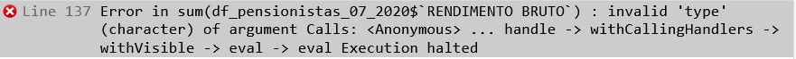

```{r setup, include=FALSE}
knitr::opts_chunk$set(echo = TRUE, warning = FALSE, message =  FALSE)

```


# 1. Introdução

## 1.1) O que é o R

A linguagem de programação R é versátil e pode ser usada para manipulação, análise, raspagem, visualização de dados, entre outros.

## 1.2) A estrututra do curso

Esta oficina foca no uso prática de consumo e análise de dados com foco na base de dados de pensionistas. O objetivo é o(a) aluno(a) sair do curso já sabendo trabalhar dados disponíveis na internet. 

Isso inclui desde fazer o download do dado até fazer tratamentos e análises que permitam responder a perguntas típicas de um ambiente de jornalismo.

## 1.3) O caso dos pensionistas

Para esta oficina, vamos usar os dados de pensionistas do governo federal.
A base de dados foi disponibilizada pelo Ministério da Economia após uma vitória do ['Fiquem sabendo'](https://fiquemsabendo.com.br/transparencia/pensionistas-e-aposentados-servidores-inativos/).

## 1.4) Download do arquivo

Os arquivos são disponibilizados por mês no portal [dados.gov.br](http://dados.gov.br/dataset/gestao-de-pessoas-executivo-federal-pensionistas) em formato CSV. 
Também há um dicionário de dados em formato PDF.

Para esta análise, vamos usar o arquivo mais recente, de **julho de 2020**. Para baixar os arquivos, acesse o link, localize o arquivo, clique em "Explorar" e depois em "Ir para recurso".

## 1.5) Instalar os pacotes

É preciso instalar alguns pacotes caso esta seja a primeira vez que você mexa com R no seu computador.

Para isso, nós vamos usar a função `install.packages()`. Dentro dos parêntesis, devemos informar o nome do pacote.

```{r} 
# install.packages("tidyverse")
# install.packages("data.table")
# install.packages("abjutils")
```

## 1.6) Carregar os pacotes

Precisamos também carregar os pacotes que serão usados.
Usamos a função `library()` e informarmos o nome do pacote dentro dos parêntesis.

```{r}
library(tidyverse)
library(data.table)
library(abjutils)
```

## 1.7) Importar o arquivo manualmente

Há diversas formas de importar um arquivo para o RStudio.
Uma das formas mais simples é:
- Clique em "File"                    
- Clique em "Import Dataset"                
- Clique em "From text (base)"                
- Selecione o arquivo               
- Cheque se tudo parece correto               
- Clique em "Import"                

## 1.8) Importar o arquivo automaticamente

Agora, vamos importar o arquivo apenas informar onde ele está e qual é o nome dele.
Neste caso, optamos por usar a função `fread()` do pacote `data.table`.

```{r}
# df_pensionistas_07_2020 <- fread("data/PENSIONISTAS_072020.csv")
df_pensionistas_07_2020 <- readRDS("data/julho2020.rds")
```

Se quisermos, podemos tambem informar ainda:
- a codificação do arquivo (encoding)               
- o separador das colunas (sep)               
- o número de linhas que queremos ler (nrows)               
- quais colunas queremos ler (colnames)           
- quais colunas não queremos ler (drop)           
- outros                

## 1.9) Descobrir a pasta

Uma das dificuldades na importação de arquivo é descobrir a pasta.
Podemos usar as funções `getwd()`, `setwd()` e `list.files()` para nos ajudar.

```{r}
getwd()
# setwd("~/Downloads")
list.files()
```

## 1.10) Verificação de o arquivo

O arquivo já foi importado e agora queremos dar uma olhada nele.
Usaremos as funções `summary()`, `glimpse()` e `View()`.

```{r}
summary(df_pensionistas_07_2020)
glimpse(df_pensionistas_07_2020)
# View(df_pensionistas_07_2020)
```

## 1.11) Verificação de partes do arquivo 

Outras funções úteis para checar o arquivo estão abaixo.
São elas: `head()`, `tail()`, `colnames()`, `unique()` e `length()`.

```{r}
head(df_pensionistas_07_2020)
head(df_pensionistas_07_2020, 15)
```

```{r}
tail(df_pensionistas_07_2020)
tail(df_pensionistas_07_2020, 14)
```

```{r}
colnames(df_pensionistas_07_2020)
```

```{r}
unique(df_pensionistas_07_2020$`NOME DO ORGAO`)
```

```{r}
length(unique(df_pensionistas_07_2020$`NOME DO ORGAO`))
length(colnames(df_pensionistas_07_2020))
```

## 1.12) Renomeação de cabeçalho 

A função `rename()` nos permite renomear alguma coluna do cabeçalho.
Outra função interessante para isso é `clean_names()`, do pacote `janitor`.

```{r}
df_pensionistas_07_2020_novo <- df_pensionistas_07_2020 %>%
  rename("servidor_instituidor" = "NOME DO SERVIDOR INSTITUIDOR")
df_pensionistas_07_2020_novo <- df_pensionistas_07_2020 %>%
  janitor::clean_names()
```

## 1.13) Outras funções úteis

As funções `toupper()` e `tolower()` colocam o texto em letra maiúscula e minúscula. 

A função `rm_accent()` do pacote `abjutils` elimina o acento do texto.

A função `str_trim()` elimina espaços excedentes antes e depois do texto.

A função `distinct()` ajuda a eliminar e identificar duplicatas.

As funções `separate()` e `unite()` separam e unem colunas com base no separador indicado.

As funções `pivot_longer()` e `pivot_wider()` reorganizam a estrutura de linhas e colunas. 


# 2. Caracterização dos dados

O uso da linguagem de programação R permite uma grande diversidade de análises e descobertas. Muitas delas podem envolver uma elevada complexidade matemática ou de recursos computacionais. 

É necessário destacar, no entanto, que no começo de tudo há a necessidade de se conhecer o melhor possível o dado que se tem em mão. Aí é comum o uso de operações de estatística descritiva como mínimo valor, máximo valor, média e mediana, por exemplo.

Observa-se ainda que mesmo para essas operações mais simples é muito frequente a necessiddade de se fazer alguns ajustes para que os dados possam ser corretamente utilizados. Nessa seção vamos fazer alguns exercícios básicos de ajuste do dado e em seguida vamos usar alguns roteiros para caracterização básica dos dados de pensionsitas.

## 2.1) Um primeiro ajuste nos dados

É importante saber se o dado que estamos utilizando está num formato que se encaixa para o tipo de operações que desejamos efetuar. Uma das situações mais frequentes que enfrentamos é quando os valores numéricos não são imediatamente reconhecidos pelo R. 

Isso ocorre quando fazemos importações de dados e elementos como vírgula e ponto que são interpretados pelo R como parte de um texto e não de um número. Isso faz com que o dado não possa ser usado em operações aritméticas simples como soma, por exemplo.

Veja abaixo as seis primeiras informações de rendimento bruto e rendimento líquido da tabela com os dados de pensionistas de julho de 2020.
```{r}
#a função head traz informações relacionadas às seis primeiras linhas de uma tabela
#o símbolo pipe %>% indica ao r que desejamos fazer alguma operação sobre a tabela.
#nesse caso a operação que desejamos fazer é a seleção das colunas Rendimento Bruto e Rendimento Líquido
head(df_pensionistas_07_2020 %>% 
         select(`RENDIMENTO BRUTO`, `RENDIMENTO LIQUIDO`))
     
```

Observe que o resultado do bloco de código anterior é uma tabela de seis linhas com duas colunas. Veja que ambas colunas estão marcadas como **chr**. Isso indica que o tipo de ambas colunas é texto e não numérico. Essa característica impede fazer operações aritméticas simples, tais como soma. Se tentarmos fazer a operação abaixo...

```{r}
# tentativa de somar os rendimentos brutos 
# sum(df_pensionistas_07_2020$`RENDIMENTO BRUTO`)
```

... vamos receber a seguinte mensagem de erro gerada pelo R



O R não permitiu fazer soma dos valores de uma coluna numérica. Precisamos então tratar essas duas colunas. Primeiramente precisamos retirar os pontos e vírgulas para deixar num formato que seja possível indicar ao R que as duas colunas são numéricas. Veja abaixo:

```{r}
#install.packages("stringr")
library(stringr) # a função str_remove_all está na library stringr
#a função mutate permite fazer alterações nos valores das colunas de uma tabela.
#Nesse caso a função mutate vai fazer alterações nos valores da coluna `RENDIMENTOS BRUTO`
#a função str_remove_all exclui partes de texto.
#Nesse caso, primeiro vai excluir todos os pontos e em seguida todas as vírgulas. Observe que no caso do ponto o R exige que o ponto esteja escrito entre colchetes[].
df_pensionistas_07_2020 <-
      df_pensionistas_07_2020 %>%
      mutate(`RENDIMENTO BRUTO` = str_remove_all(`RENDIMENTO BRUTO`,"[.]"),
             `RENDIMENTO BRUTO` = as.numeric(str_remove_all(`RENDIMENTO BRUTO`,",")))
#no fim vamos repetir novamente a instrução do bloco anterior.
head(df_pensionistas_07_2020 %>% 
         select(`RENDIMENTO BRUTO`, `RENDIMENTO LIQUIDO`))
```

Observe que agora a coluna "Rendimento Bruto" não está mais marcada como **chr** e sim como **dbl**, que é um tipo numérico. Obseve ainda que se compararmos os valores de rendimento bruto antes e após a transformação veremos que o valor está 100 vezes maior. Isso decorre pelo fato de termos retirado a notação da vírgula. Precisamos então dividir a coluna por 100 para recuperarmos o valor correto. Veja abaixo:

```{r}
#o novo valor da coluna rendimento bruto vai ser o valor que a coluna tem no momento divido por 100
df_pensionistas_07_2020 <-
      df_pensionistas_07_2020 %>%
      mutate(`RENDIMENTO BRUTO` = `RENDIMENTO BRUTO`/100)
#agora executamos novamente a exibição dos seis primeiros valores da tabela
head(df_pensionistas_07_2020 %>% 
         select(`RENDIMENTO BRUTO`, `RENDIMENTO LIQUIDO`))
```

Perfeito. Agora temos o valor de rendimento bruto já transformado para numérico e está também com o valor correto. A coluna redimento líquido continua com problema. Temos que refazer todo o procedimento feito em redimento bruto na coluna rendimento líquido. É isso o que é feito logo abaixo.

```{r}
df_pensionistas_07_2020 <-
      df_pensionistas_07_2020 %>%
      mutate(`RENDIMENTO LIQUIDO` = str_remove_all(`RENDIMENTO LIQUIDO`,"[.]"),
             `RENDIMENTO LIQUIDO` = as.numeric(str_remove_all(`RENDIMENTO LIQUIDO`,",")))
df_pensionistas_07_2020 <-
      df_pensionistas_07_2020 %>%
      mutate(`RENDIMENTO LIQUIDO` = `RENDIMENTO LIQUIDO`/100)
head(df_pensionistas_07_2020 %>% 
         select(`RENDIMENTO BRUTO`, `RENDIMENTO LIQUIDO`))
```

Agora que as duas colunas já estão no formato correto, podemos calcular o total de rendimento bruto e de rendimento líquido pago processados em julho de 2020.

```{r}
#somatório do rendimento bruto
sum(df_pensionistas_07_2020$`RENDIMENTO BRUTO`)
#somatório do rendimento líquido
sum(df_pensionistas_07_2020$`RENDIMENTO LIQUIDO`)
```

Com isso já temos repostas a duas perguntas que podem ser interessantes de ser respondidas quando se trata dos dados de pensionistas. Considerando o último mês disponível qual é o total de rendimentos líquido e bruto pagos pelo governo federal brasileiro. Vamos ver em seguida algumas funções de estatística descritiva que ajudam na formulação da resposta a outras perguntas para essa base.


## 2.2) Caracterização dos dados de pensionistas

Uma das melhores feramentas para descobrirmos o que caracteriza os dados que esperamos analisar é a estatística descritiva. E antes que se assuste, aqui vamos falar de coisas que já usamos há muito tempo: contagem, média, valor máximo, valor mínimo, mediana e também ordenação de dados por valores.  

## 2.3) Contagem de ocorrências

A base de dados de pensionista é do tipo tabular. As bases tabulares são aquelas que se estruturam em linhas e colunas. A contagem de ocorrências em dados tabulares, nada mais é do que a indicação do número de linhas de uma tabela que se enquadram dentro de um determinado parâmetro.

A tabela que estamos trabalhando se refere às pensões que foram pagas em julho de 2020. Para sabermos o número de pensões que se enquadram nessa característica basta contar o número de linhas da tabela. Veja o bloco de código abaixo.

```{r}
#a função que indica o número de linhas de uma tabela á NROW. 
NROW(df_pensionistas_07_2020)
```

Utilizando o bloco de código acima descobrimos que 295.468 é o número de pensões pagas em Julho de 2020.

Agora vamos imaginar que queremos saber se há mais pensionistas com pensõs temporárias ou vitalícias. Existem algumas formas de se fazer isso. Por enquanto vamos explicar a mais simples que é com o uso de filtros.

```{r}
#A função filter indica ao R qual a condição de filtro que se deseja executar sobre a tabela.
#No primeiro caso vamos filtrar todas as pensões cuja na ntureza ( campo Natureza Pensao) seja vitalícia
NROW(df_pensionistas_07_2020%>%
  filter(`NATUREZA PENSAO` == "VITALICIA"))
#Fazemos a mesma coisa agora com as pensões temporárias
#Observe o operador ==  usado para fazer comparações de igualdade
NROW(df_pensionistas_07_2020%>%
  filter(`NATUREZA PENSAO` == "TEMPORARIA"))
```

Observe no código acima que a função de contagem de linhas NROW não é mais aplicada à tabela completa, mas apenas ao resultado dos dois filtros sobre a tabela. 

Com a contagem das linhas dos dois filtros temos que o número de pensões vitalícias corresponde a quase o dobro das pensões temporárias.

## 2.4) Valores máximos e mínimos

É muito simples descobrir os valores máximos e mínimos de qualquer conjunto de dados usando o R. Veja o bloco de código abaixo para o caso do valor máximo.

```{r}
# Max: a função para descobrir o valor máximo 
#Logo abaixo temos o valor máximo de rendimento bruto
max(df_pensionistas_07_2020$`RENDIMENTO BRUTO`)
#E aqui o valor máximo de rendimento líquido
max(df_pensionistas_07_2020$`RENDIMENTO LIQUIDO`)
```

E aqui abaixo veja como descobrimos o valor mínimo

```{r}
# Min: a função para descobrir o valor mínimo 
#Logo abaixo temos o valor mínimo de rendimento bruto
min(df_pensionistas_07_2020$`RENDIMENTO BRUTO`)
#E aqui o valor mínimo de rendimento líquido
min(df_pensionistas_07_2020$`RENDIMENTO LIQUIDO`)
```

Observe que aparecem valores estranhos ao que esperaríamos. No caso do valor máximo, os rendimentos bruto e líquido são iguais e esperaríamos o bruto > líquido. 

Já no caso de valor mínimo os valores estão zerados para ambas variáveis. 

Esse é um tipo de situação comum em ciência de dados: identificar ocorrência inesperadas que requerem maiores investigações e eventualmente faxina dos dados. Aqui vamos tentar investigar um pouco mais do que se tratam esses dados. Uma opção interessante é usar o **ordenamento de valores** e descobrir mais informações que possam nos ajudar a tomar decisões sobre os dados.

Vamos começar ordenando os valores em ordem decrescente e capturando apenas as 10 primeiras linhas

```{r}
# a função slice_max vai nos trazer os n maiores valores de um conjunto de dados de acordo com uma variável que indicarmos.
# no caso abaixo o n=10 (os dez maiores valores) da variável rendimento bruto
# o select que vem logo em seguida indica ao R que queremos que sejam exibidas apenas as colunas `NOME DO SERVIDOR INSTITUIDOR`, `RENDIMENTO BRUTO`, `RENDIMENTO LIQUIDO`
df_pensionistas_07_2020 %>%
  slice_max(`RENDIMENTO BRUTO`,n=10) %>%
  select(`NOME DO SERVIDOR INSTITUIDOR`, `RENDIMENTO BRUTO`, `RENDIMENTO LIQUIDO`)
```

Como se vê, pode-se descartar problemas maiores na base já que da amostra dos 10 valores brutos mais elevados, apenas justamente o maior rendimento bruto tem valor igual ao maior rendimento líquido. Existem algumas possibilidades para que isso ocorra, mas pode ser um erro mesmo da base. O R nos ajudou aqui a descobrir com certa facilidade um ponto de investigação.

Agora vamos tentar ver o que está por trás dos valor mínimo ser zerado. As próximas linhas de código tratam disso

```{r}
# a função slice_min vai nos trazer os n menores valores de um conjunto de dados de acordo com uma variável que indicarmos.
# no caso abaixo o n=10 (os dez maiores valores) da variável rendimento bruto
# o select que vem logo em seguida indica ao R que queremos que sejam exibidas apenas as colunas `NOME DO SERVIDOR INSTITUIDOR`, `RENDIMENTO BRUTO`, `RENDIMENTO LIQUIDO`
df_pensionistas_07_2020 %>%
  slice_min(`RENDIMENTO BRUTO`, n=10) %>%
  select(`NOME DO SERVIDOR INSTITUIDOR`, `RENDIMENTO BRUTO`, `RENDIMENTO LIQUIDO`)
```

Observe que o R indica que o resultado do código é uma tabela com o número de linhas bem maior do que esperávamos: **## # A tibble: 3,722 x 3**. São mais de 3.700 linhas a mais. Isso se deve porque existem 3.722 linhas em que o valor de rendimento bruto = 0. Esse achado sugere que o valor mínimo da base bruta não caracteriza por si só os menores valores de rendimento bruto ou de rendimento líquido. É preciso retirar da nossa análise essas linhas para chegarmos a valores mais apropriados. Vamos ver como se faz isso no bloco de código abaixo.

```{r}
#nesse bloco de código, antes de descobrirmos os valores mínimos fazemos o filtro para que permaneçam na nossa análise apenas as linhas da tabela que tenham valor de rendimento bruto >= 0.01. Para isso usamos a função filter
df_pensionistas_07_2020 %>%
  filter(`RENDIMENTO BRUTO`>=0.01)%>%
  slice_min(`RENDIMENTO BRUTO`, n=10) %>%
  select(`NOME DO SERVIDOR INSTITUIDOR`, `RENDIMENTO BRUTO`, `RENDIMENTO LIQUIDO`)
```

Agora temos a informação no caminho que desejamos. Muito embora os valores ainda estejam muito baixos. Observe ainda que existem algumas linhas em que não há informação do servidor instituidor. Isso sugere uma tarefa de avaliação dos valores ausentes e tentar entender o que gera esses valores tão baixos para tomar decisão sobre o que fazer na faxina de dados. Mas isso é outro assunto. Por enquanto parece que está fácil de caracterizar os valores mínimos e máximos com as instruções que passamos até agora, que é o objetivo dessa seção.

## 2.5) Médias e medianas

A média e a mediana são conhecidas como medidas de centralidades na estatística. A função delas é caracterizar um conjunto de dados a partir do que fosse mais comum do dado. É importante conhecer as duas medidas já que em algumas situações uma pode ser mais recomendada que a outra.

Vamos começar com o cálculo da média. Lembrando que essa medida é calculada pela somatória dos valores/número de valores. No bloco abaixo vamos conhecer o uso da média no R.

```{r}
# a função mean faz o cálculo da média
# abaixo a média dos rendimentos brutos e dos rendimentos líquidos
mean(df_pensionistas_07_2020$`RENDIMENTO BRUTO`)
mean(df_pensionistas_07_2020$`RENDIMENTO LIQUIDO`)
```

Como era de se esperar a média dos valores de rendimento bruto é maior do que o rendimento líquido. 

Agora vamos ver o cálculo da mediana. Antes, vale recordar que a mediana é uma medida de posição. É o valor que fica no meio de uma série de valores ordenados. 

Se temos, por exemplo, 11 valores numéricos, ordenamos esses valores e a mediana será o valor que ficar na posição 6, já que teremos cinco valores maiores e cinco valores menores do que o que está na posição 6.

```{r}
# a função median faz o cálculo da média
# abaixo a mediana dos rendimentos brutos e dos rendimentos líquidos
median(df_pensionistas_07_2020$`RENDIMENTO BRUTO`)
median(df_pensionistas_07_2020$`RENDIMENTO LIQUIDO`)
```

Observe que quando se trata de mediana, novamente o valor relativo a rendimento bruto é maior do que o relativo a rendimento líquido. Mas esse achado dos valores da mediana traz alguns pontos para análise

- O primeiro é que a diferença entre as duas medianas é bem menor do que a diferença entre as duas médias

- O segundo é que os valores de médias para ambas variáveis, mas principalmente para rendimento bruto, é bem maior do que a mediana.

Essas situações são relativamente comuns. É importante entender a dinãmica de formação desses valores e a distribuição dos valores para encontrar o que melhor caracteriza os dados, se a média ou mediana. Esse é um assunto importante e que deve ser melhor explorado. Aqui foge do objetivo dessa aula.

# 3. Trabalhando as colunas da tabela

Usando as funções do pacote tidyverse fica muito fácil de se trabalhar com colunas em tabelas do R. Às vezes é necessario alterar valores e tipos. E algumas vezes é também interessante acrescentar novas colunas que são formadas a partir de colunas já previamente existente. Vamos explorar um pouco essas possibildiades nesse bloco.

## 3.1) Modificando colunas tipo data

Na seção anterior vimos como fazer modificações nas duas colunas relativas a valores numéricos. Outro tipo de variável que é bem comum fazermos modificações são as do tipo data. Na tabela que estamos trabalhando as datas estão em um formato pouco usual e que não é rapidamente reconhecida pelo R como data. Isso impede a possibilidade de se fazer operações de data que possam responder, por exemplo, qual a pensão mais antiga paga em Julho de 2020.

Antes de prosseguirmos mostrando como se faz a transofrmação de variável tipo data, é interessante dar uma olhada em algumas amostras de datas para duas variáveis desse tipo.

```{r}
head(df_pensionistas_07_2020%>%
       select(`DATA INICIO DO BENEFICIO`, `DATA DE NASCIMENTO` ))
```

Observe que as datas são formadas pela concatenação de dia, mês e ano. Por exemplo, na primeira linha a data 10021998 corresponde a 10/02/1998. O nosso objetivo é fazer uma transformação para que o R possa compreender que isso é uma data. Para o R uma data tem que estar no formato aaaa-mm-dd. No caso da data exemplificada essa data teria que ser representada como 1998-02-10.

No bloco de código logo abaixo vamos ver como fazemos modificações em colunas 

```{r}
#para podermos usar as funções que facilitam o trabalho com datas é necessário usar o pacote lubridate. Lembre de instalá-lo antes, caso não esteja ainda instaldo, usando a função install.package()
library(lubridate)
#A função dmy indica que a variável que está sendo passada como parâmetro está no formato dia, mês, ano. Com essa informação o R é capaz de fazer a transformação e gerar a data correta
df_pensionistas_07_2020<-
df_pensionistas_07_2020 %>%
  mutate(`DATA INICIO DO BENEFICIO` = dmy(`DATA INICIO DO BENEFICIO`),
         `DATA DE NASCIMENTO` = dmy(`DATA DE NASCIMENTO`)) 
head(
df_pensionistas_07_2020%>%
  select(`DATA INICIO DO BENEFICIO`, `DATA DE NASCIMENTO`))
```

Observe agora que as duas datas que trabalhamos já estão no formato correto e  podem ser usadas em operações típicas de data.

## 3.2) Acresecentando colunas derivadas de data

A partir das duas colunas que acabamos de fazer os ajustes, vamos criar duas novas colunas que indicam o tempo de recebimento da pensão e idade de beneficiário. Vamos ver como isso pode ser feito.

```{r}
# Para fazermos o cálculo das duas novas variáveis vamoos precisar usar mais duas  funções que estão no pacote lubridate que já foi carregado no bloco de códigos anterior. Essas funções são today e year
# A função today informa a data de hoje
# A função year informa o ano de uma determinada data
df_pensionistas_07_2020<- 
df_pensionistas_07_2020 %>%
  mutate(tempo_recebimento_pensao = year(today()) - year(`DATA INICIO DO BENEFICIO`)) %>%
  mutate(idade_beneficario = year(today()) - year(`DATA DE NASCIMENTO`))
df_pensionistas_07_2020 %>%
  select(`NOME DO BENEFICIARIO`, tempo_recebimento_pensao, idade_beneficario)
```

Aqui vale explorar um pouco mais o bloco de código logo acima. Começando pelo trecho abaixo

```
year(today())
```

Esse trecho vai trazer como resultado o ano **[função year]** referente à data de hoje **[função today()]**

Vamos analisar agora esse outro trecho de código

```
tempo_recebimento_pensao = year(today()) - year(`DATA INICIO DO BENEFICIO`)
```

Aqui estamos calculando o intervalo em anos entre duas datas. No caso, a diferença entre o ano da data de hoje e a data do início do benefício

Agora que já temos a data de início do benefício, podemos saber, por exemplo, quem são os 10 beneficiários com os maiores tempos de benefício.

```{r}
#Aqui usamos novamente a função slice_mas para descobrir os N maiores valores de uma variável
df_pensionistas_07_2020 %>%
  slice_max(tempo_recebimento_pensao, n=10) %>%
  select(`NOME DO BENEFICIARIO`, tempo_recebimento_pensao)
```

Temos então a impressionante informação de que existem benefícios seculares. Se isso não for erro da base, dá uma boa dica de matéria, não é mesmo?

E que tal agora descobrirmos os beneficiários mais velhos. Vamos seguir a mesma lógica do bloco de código anterior.

```{r}
#Aqui usamos novamente a função slice_mas para descobrir os N maiores valores de uma variável
df_pensionistas_07_2020 %>%
  slice_max(idade_beneficario, n=10) %>%
  select(`NOME DO BENEFICIARIO`, idade_beneficario)
```

Novamente  as informações que aparecem são de chamar muita atenção. A lista dos beneficários mais idosos são de super-centenários. De novo isso indica ou problema na base ou uma dica de matérias muito interessantes.

Isso nos leva à curiosidade de fazer novas ordenações, levando agora em consideração as duas informações de tempo de benefício e idade do beneficiário no resultado da consulta.

```{r}
#Aqui usamos novamente a função slice_mas para descobrir os N maiores valores de uma variável
df_pensionistas_07_2020 %>%
  slice_max(idade_beneficario, n=10) %>%
  select(`NOME DO BENEFICIARIO`, idade_beneficario, tempo_recebimento_pensao)
```

```{r}
#Aqui usamos novamente a função slice_mas para descobrir os N maiores valores de uma variável
df_pensionistas_07_2020 %>%
  slice_max(tempo_recebimento_pensao, n=10) %>%
  select(`NOME DO BENEFICIARIO`, tempo_recebimento_pensao, idade_beneficario)
```


## 3.3) Acrescentando colunas resultadas de valores numéricos

Vimos o ganho de análises quando acrescentamos novas colunas a partir de infomações de data. Agora vamos acrescentar uma outra coluna, faixa de rendimento bruto, que no caso será de tratamento de coluna de valor numérico.

```{r}
#para identificar as faixas salariais usamos duas funcões case_hwen e betewwem
# a função case_when testa condições para identificar o valor que uma variável vai assumir.
#No caso, a função case_when vai testar condições sobre a variável rendimento bruto para gerar o valor para a variável faixa_rendimento_bruto
# a função between indica se um dado valor está dentro de uma faixa de valores numéricos
df_pensionistas_07_2020 <-
df_pensionistas_07_2020 %>%
  mutate(faixa_rendimento_bruto = case_when(
    `RENDIMENTO BRUTO`<=2000 ~ '0-2000 reais',
    between(`RENDIMENTO BRUTO`,2001, 4000) ~ 'Faixa 1: 2001-4000 reais',
    between(`RENDIMENTO BRUTO`,4001, 6000) ~ 'Faixa 2: 4001-6000 reais',
    between(`RENDIMENTO BRUTO`,6001, 8000) ~ 'Faixa 3: 6001-8000 reais',
    between(`RENDIMENTO BRUTO`,8001, 10000) ~ 'Faixa 4: 8001-10000 reais',
    between(`RENDIMENTO BRUTO`,10001, 15000) ~ 'Faixa 5: 10001-15000 reais',
    `RENDIMENTO BRUTO` >= 15001 ~'Faixa 5: 15001 reais ou mais')
    
  ) 
```

Com a execução do bloco de código acima, a tabela já possui a informação da faixa de valores de rendimento bruto que será usada para tratamento de agrupamentos.

## 3.4) Acrescentando colunas de outras tabelas

Uma das possiblidades interessantes de se trabalhar com linguagem de programação, como o **R**, é a facilidade de se fazer cruzamentos com outras tabelas.

Vamos imaginar, por exemplo, que queremos identificar fenômenos que relacionem o recebimento de pensões à abertura de empresas. Para isso, vamos cruzar a tabela de pensionistas com a tabela de sócios de empresas, disponível no [Brasil.io](https://brasil.io/dataset/socios-brasil/socios/).

```{r}

socio_amostra <- readRDS("data/socio_amostra.rds")
```


```{r}
df_pensionistas_07_2020<-
df_pensionistas_07_2020 %>%
  mutate( chave= str_c(`CPF DO BENEFICIARIO`, `NOME DO BENEFICIARIO`))

df_Pensionista_socio<-
df_pensionistas_07_2020 %>%
  inner_join(socio_amostra)
  
```

Acabamos de criar uma outra tabela com 300 linhas que apresentam todas os pensionistas que foram localizadas numa tabela que tem 300.000 CPFs ligados a alguma sociedade de empresa. Um exercício interessante a ser feito aqui é tentar diferenciar o grupo dos pensionistas sócios do conjunto total dos pensionistas em julho de 2020. Vamos comparar, por exemplo, a média dos rendimentos brutos e líquidos.

```{r}
mean(df_pensionistas_07_2020$`RENDIMENTO BRUTO`)
mean(df_Pensionista_socio$`RENDIMENTO BRUTO`)

mean(df_pensionistas_07_2020$idade_beneficario, na.rm = TRUE)
mean(df_Pensionista_socio$idade_beneficario, na.rm = TRUE)

mean(df_pensionistas_07_2020$tempo_recebimento_pensao, na.rm = TRUE)
mean(df_Pensionista_socio$tempo_recebimento_pensao, na.rm = TRUE)


```

Observando o que sai nas nas seis linhas de código acima, parece que as médias de rendimento bruto de pensionistas que são sócios é bem maior do que a mesma média do conjunto total. Já quando se vê a comparação das idades dos beneficiários não há praticamente diferença nas médias. Por outro lado volta a ter diferença nas médias quando se compara o tempo de recebimento das pensões.

# 4. Agrupando e filtrando dados

## 4.1) Agrupar por órgão

Agora vamos fazer algo parecido com a tabela dinâmica do Excel / Google Spreadsheet. Para agrupar os dados usamos `group_by()` e informamos por qual coluna queremos agrupar. 

Em seguida, o `summarise()` - ou `summarize()` - vai contar o número de linhas, com `n()`. E também vai somar os valores da coluna "RENDIMENTO BRUTO", com `sum()`.

```{r}
pens_orgao <- df_pensionistas_07_2020 %>%
  group_by(`NOME DO ORGAO`) %>%
  summarise(contagem = n(),
            soma = sum(`RENDIMENTO BRUTO`))
```

## 4.2) Agrupar por tipo de beneficiário

A única diferença em comparação com o código anterior é a coluna informada em `group_by()`.

```{r}
pens_beneficiario <- df_pensionistas_07_2020 %>%
  group_by(`TIPO DE BENEFICIARIO`) %>%
  summarise(contagem = n(),
            soma = sum(`RENDIMENTO BRUTO`))
```

## 4.3) Agrupar por tipo de pensão (vitalícia, temporária) 

Novamente, só vamos mudar a coluna informada dentro de `group_by()`.

```{r}
pens_tipo <- df_pensionistas_07_2020 %>%
  group_by(`NATUREZA PENSAO`) %>%
  summarise(contagem = n(),
            soma = sum(`RENDIMENTO BRUTO`))
```

## 4.4) Agrupar por UF 

Mudamos novamente a coluna informada dentro de `group_by()`.
Além de `n()` e `sum()`, aqui também usamos `mean()` e `median()`.

```{r}
pens_uf <- df_pensionistas_07_2020 %>%
  group_by(`UF DA UPAG DE VINCULACAO`) %>%
  summarise(contagem = n(),
            soma = sum(`RENDIMENTO BRUTO`),
            média = mean(`RENDIMENTO BRUTO`),
            mediana = median(`RENDIMENTO BRUTO`))
```

## 4.5) Filtrar por órgão e ver quem ganha mais

Usamos o `filter()` para filtrar o órgão de interesse.
Depois, usamos `arrange()` para ordenar em ordem decrescente, com `desc()`.

```{r}
pens_orgao_MS <- df_pensionistas_07_2020 %>%
  filter(`NOME DO ORGAO` == "MINISTERIO DA SAUDE") %>%
  arrange(desc(`RENDIMENTO BRUTO`))
```

## 4.6) Filtrar por órgão e cargo e ver quem ganha mais

Aqui usamos o `filter()` novamente.
Desta vez, definimos interesses em duas colunas.
Os dois quesitos precisam ser cumpridos.

```{r}
pens_cargo_MS_MEDICO <- df_pensionistas_07_2020 %>%
  filter(`NOME DO ORGAO` == "MINISTERIO DA SAUDE" &
           `CARGO SERVIDOR INSTITUIDOR` == "MEDICO") %>%
  arrange(desc(`RENDIMENTO BRUTO`))
```

## 4.7) Filtrar por três órgãos e ver quem ganha mais

Agora, pedimos ao `filter()` para manter apenas as linhas em que aparece alguma daquelas siglas.

```{r}
pens_cargo_MS_ME_MCTIC <- df_pensionistas_07_2020 %>%
  filter(`SIGLA DO ORGAO` == "MS" |
         `SIGLA DO ORGAO` == "ME" |
         `SIGLA DO ORGAO` == "MCTIC") %>%
  arrange(desc(`RENDIMENTO BRUTO`))
```

# 5. Baixando e salvandos os dados

Conforme já dito logo no início, os dados com que estamos trabalhando estão disponíveis na internet. Vamos ver como podemos usar o R para baixar esses dados para seu ambiente computacional. Também vamos ver como salvar o trabalho que você fez em arquivo CSV para ser aproveitado em outros usos que não seja a partir da linguagem R e, por fim, você vai prender a ler vários arquivos com um único comando.

## 5.1) Download automatizado do CSV

É muito simples fazer o download de um arquivo CSV. Basta uma única instrução. Veja abaixo.

```{r}
# A função downloadfile vai fazer o download a partir de um endereço de internet especificado e acrescentar o arquivo numa pasta de destino informada
download.file("http://repositorio.dados.gov.br/segrt/pensionistas/PENSIONISTAS_072020.zip", destfile = "data/PENSIONISTAS_072020.zip", mode="wb")

```

Você vai observar na pasta destino que esse arquivo veio zipado. Isso vai dificultar a maior parte dos trabalhos que queiramos fazer com o arquivo. O mais interessnate é descompactá-lo e em seguida trabalhar com o formato CSV. Veja abaixo como fazer isso.

```{r}
unzip(zipfile = "data/PENSIONISTAS_072020.ZIP", exdir = "data/csv")
```


## 5.2) Salvando o trabalho

A função `write.csv()` salva o dataframe que você criou usando o R. Basta informar o nome do dataframe e, em seguida, o nome do arquivo que você quer gerar e a extensão CSV.

```{r}
write.csv(pens_cargo_MS_ME_MCTIC, "pens_cargo_MS_ME_MCTIC.csv")
```

## 5.3) Leitura de vários arquivos

Baixamos todos os CSVs referentes aos meses de 2020. Em seguida, lemos o CSV com o `fread()` no RStudio e logo salvamos o dataframe com `saveRDS()`. Para **janeiro de 2020**, por exemplo, veja abaixo.

OBS: Você não precisa fazer isso porque todos os arquivos RDS já estão salvos dentro de uma pasta chamada "pensionistas_2020", que está dentro da pasta "data".

PENSIONISTAS_012020 <- fread("PENSIONISTAS_012020.csv")
saveRDS(PENSIONISTAS_012020, file = "PENSIONISTAS_012020.rds")

Abaixo listamos os arquivos RDS que estão na nossa pasta.

```{r}
arquivos <- list.files("data/pensionistas_2020")
```

Agora vamos informar dentro de `map_df()` o caminho ("data/pensionistas_2020/"), seguido pelo nome dos arquivos (estão guardados dentro "arquivos"), a função `readRDS` (que faz a leitura de RDS) e também `.id = "source"` para uma coluna difereciar o arquivo de origem. 

```{r}
getwd()
pensionistas_2020_all <- map_df(paste0("data/pensionistas_2020/", arquivos), readRDS, .id = "source")
```

# 6. Agradecimentos

## 6.1) Fim

Obrigado por acompanhar a oficina até aqui. Há inúmeras possibilidades com o R, então não deixe de pesquisar e buscar por outros materiais.

Obrigado também à Abraji pela iniciativa e pelo convite.

Caso queira entrar em contato, nós estamos disponíveis aqui:

Gabriela Caesar - [Twitter](https://twitter.com/gabrielacaesar) / [Site](https://www.gabrielacaesar.com/)                           
Fernando Barbalho - [Twitter](https://twitter.com/barbalhofernand)                


